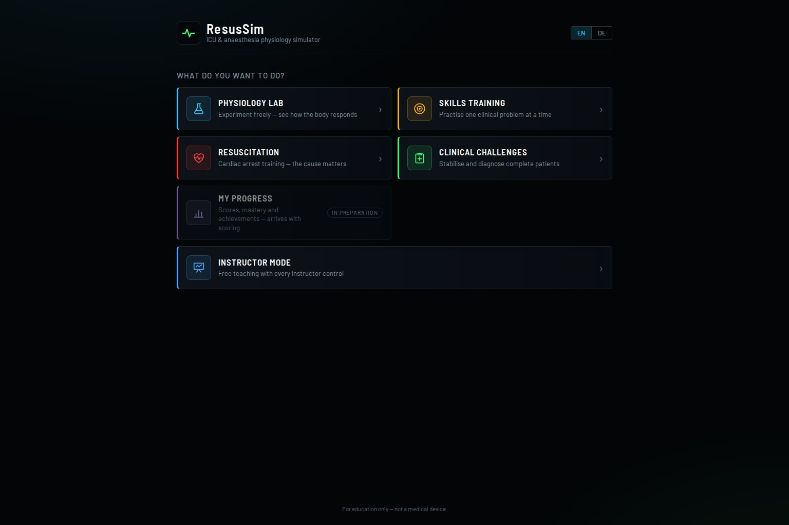
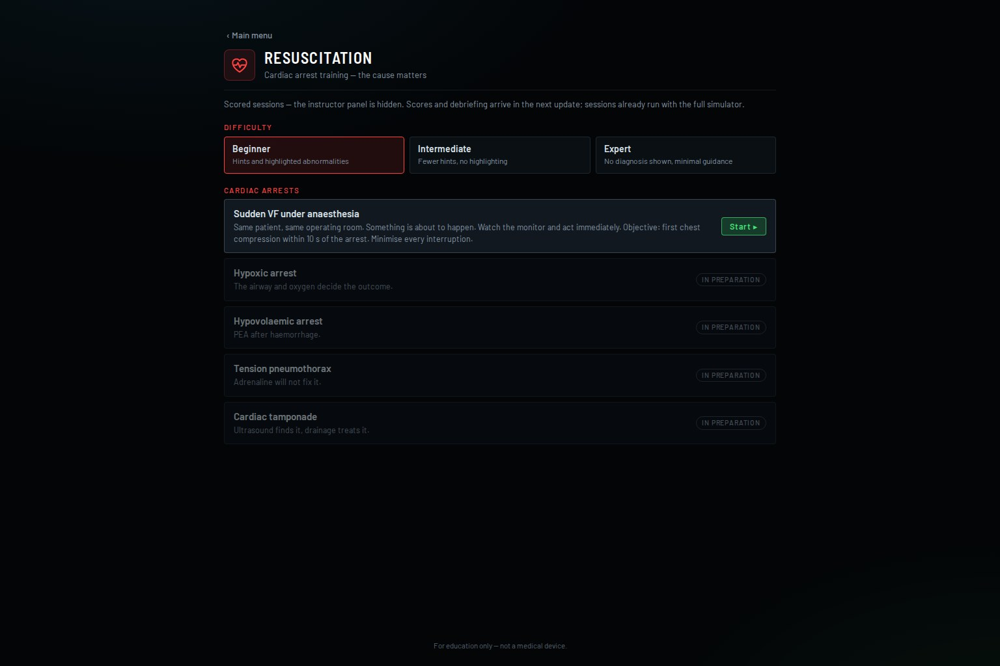
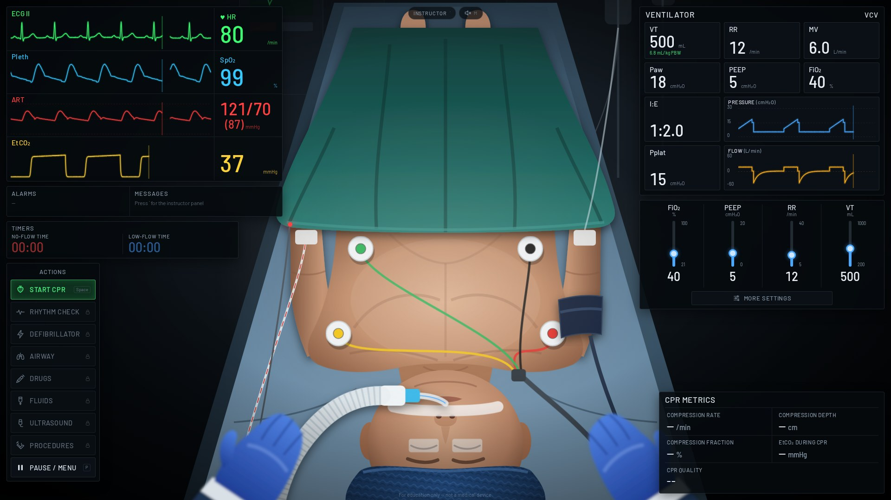
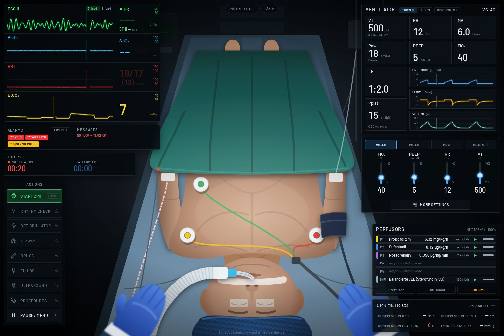
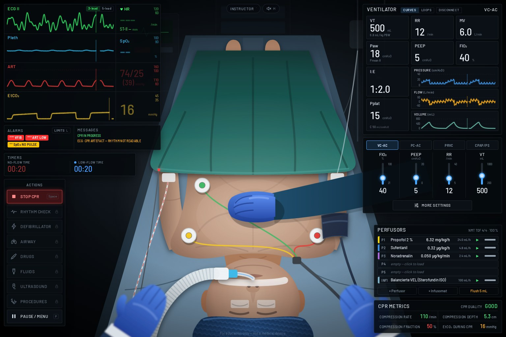
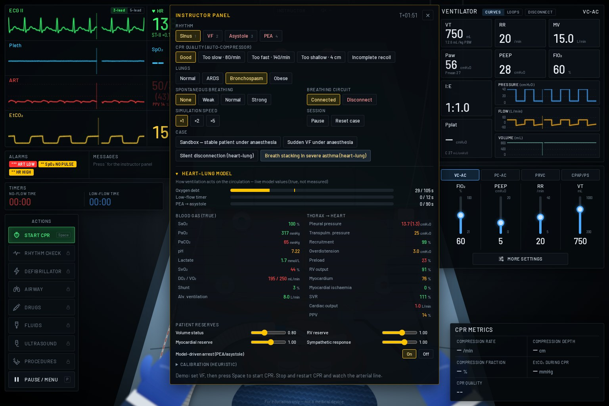
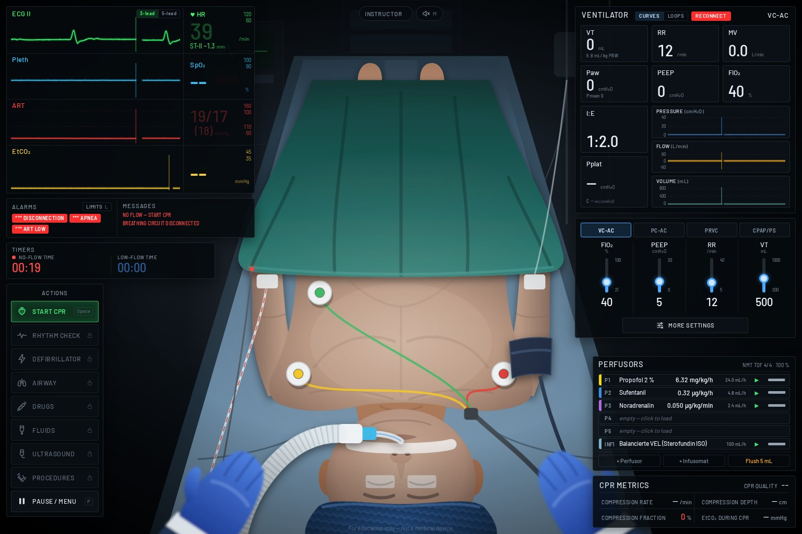
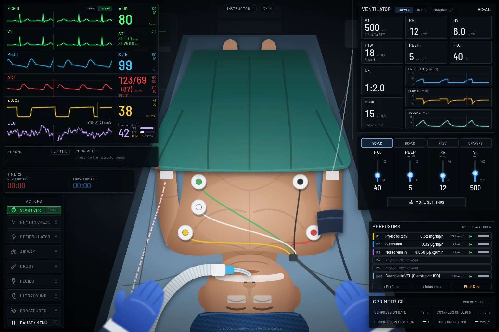
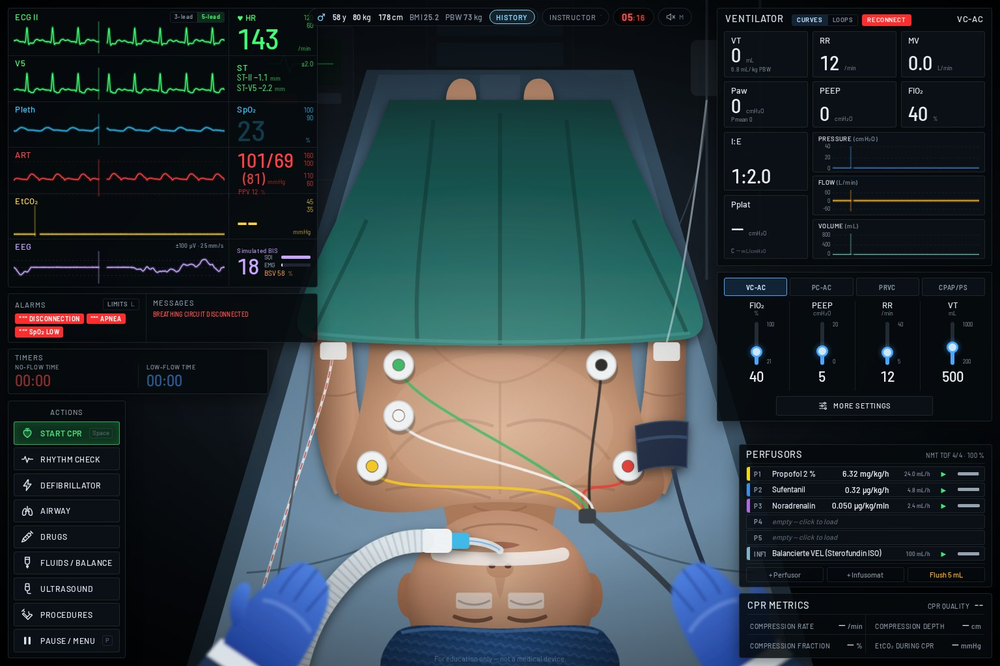
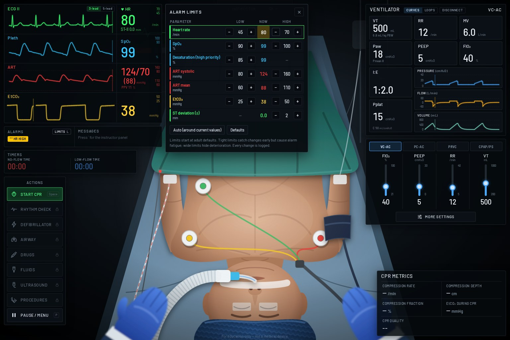

# ResusSim — Resuscitation & Ventilation Simulator

A browser-based, real-time serious game in which young anaesthesiologists and emergency physicians train
cardiopulmonary resuscitation, mechanical ventilation and (later) anaesthesia crisis management. The player
stands at the patient's head, sees the patient in first person, and watches the monitors show the physiology
respond second by second.

> *Every second matters. Every interruption matters. Every intervention changes physiology.
> The monitor tells the story of what is happening inside the patient.*

**Status: full physiology simulator (ventilation, heart–lung, drugs, fluids, processed EEG, ALS) + milestone 6
phase 1: HOME screen, module menus and learning sessions.** For education only — not a medical device.

| HOME | Module menu (scored module with difficulty) |
|---|---|
|  |  |



| VF, no CPR (20 s) | VF with CPR (20 s) |
|---|---|
|  |  |

| Breath stacking: auto-PEEP 28, MAP 45 (instructor panel) | Unnoticed disconnection → hypoxic PEA |
|---|---|
|  |  |

| 5-lead ECG: V5 trace, ST-II / ST-V5 | Hypoxaemic tachycardia: ST depression, deepest in V5 |
|---|---|
|  |  |

| Alarm limits beside every value, limit editor (HR high limit lowered → HR HIGH) |
|---|
|  |

## Quick start

Requirements: Node.js ≥ 20.

```bash
npm install
npm run dev        # http://localhost:5173
```

| Command | What it does |
|---|---|
| `npm run dev` | Start the development server |
| `npm test` | Unit tests (Vitest) — simulation, physiology targets, adapters |
| `npm run test:e2e` | Playwright smoke test (starts the dev server if needed) |
| `npm run typecheck` | TypeScript (strict) |
| `npm run lint` | ESLint, including the layer-dependency rules |
| `npm run build` | Production build in `dist/` |
| `npm run screenshots` | Visual QA screenshots into `docs/screenshots/` (dev server must be running) |

URL options: `?autostart` skips HOME and the intro and opens the instructor sandbox, `?lang=de` starts in German, `?debug` exposes
`window.__resusEngine` and a frame-cost meter (`window.__resusFrameMs`).

## Learning structure (milestone 6)

The app opens on **HOME**. Choose what to do; each entry starts a **session** (module + entry + difficulty +
seed) and opens the clean clinical workspace. Brief: [`docs/prompts/milestone-06-learning-architecture.md`](docs/prompts/milestone-06-learning-architecture.md).

| Module | Now | Scored | Instructor panel |
|---|---|---|---|
| **Physiology Lab** | Ventilation Lab (healthy lungs with experiments, severe asthma, ARDS), Haemodynamics & Drug Lab (free, post-operative bleeding; other phenotypes in preparation), Fluids & Balance Lab (7 presets) | no | yes |
| **Skills Training** | Ventilation troubleshooting: silent disconnection (more exercises and the arrhythmia trainer in preparation) | yes | hidden |
| **Resuscitation** | Sudden VF under anaesthesia (cause-specific arrests in preparation) | yes | hidden |
| **Clinical Challenges** | categories shown, validated cases in preparation (max. 5, owner-reviewed) | yes | hidden |
| **My Progress** | arrives with scoring (phase 3) | — | — |
| **Instructor Mode** | today's free sandbox plus every existing scenario as a starting situation | no | yes |
| *Daily Challenge* | hidden until validated cases exist (date-derived seed already in `src/game/session.ts`) | — | — |

- Scored modules offer **Beginner / Intermediate / Expert** (remembered). Difficulty changes the help, never the
  physiology; scores and the debrief arrive in phase 3.
- The **session intro** shows the case; the patient waits paused until **Start**. The pause menu offers
  *Resume*, *Restart session*, *End session* (back to the module menu), *Main menu* and the settings. Case lists
  are no longer in the pause menu or the instructor panel.
- Outside a session the engine is paused and no workstation is mounted. Desktop and phone layouts both have HOME.
- **SIM TIME ×1 / ×2 / ×5** in the top bar (every session): the physiology runs faster, but the monitor keeps
  sweeping at 25 mm/s and beeping at the real heart rate — it shows the most recent real beats and breaths
  (`DisplayStream`). Time feels faster; the monitor never looks fast-forwarded.
- **ADVANCE** (⏩): jump 1, 5, 15 or 60 simulated minutes in a few seconds. It stops by itself at a clinical
  event (a new high-priority alarm, a cardiac arrest, the end of the case) and returns to live ×1 with a short
  notice; **Stop** ends it any time. **Auto speed** (pause menu, on by default) also returns ×2/×5 to ×1 at a
  clinical event: "Clinical event — simulation returned to real time".
- **Clinical observation — the nurse** (milestone 6c, `src/sim/director/ObservationEngine.ts`, defaults in
  `src/content/director/observationDefaults.ts`): Nurse Anna watches the measured values like an experienced ICU
  nurse — absolute value, persistence, trend against the patient's own baseline, case targets and what she already
  said. Four levels: a small trend notice (no speed change), a concern card (×5 → ×2, stops Advance time), an
  urgent red-framed card (×1) and a critical alert (×1). Episodes with hysteresis and escalation instead of
  repeats; several findings become one sentence ("The patient is deteriorating: saturation 82 %, mean pressure 50,
  heart rate 150"). "No pulse!" comes with a **Start compressions** button — the learner decides. Expert sessions
  hear only what would naturally be said ("MAP 51."). Cases set their targets (permissive hypercapnia in asthma,
  SpO₂ 88–92 % in ARDS).
- **Event Director** (`src/sim/director`, case rules in the scenarios): the bedside talks.
  Nurse Anna reports what she sees ("Doctor, the blood pressure keeps falling — mean pressure 52 mmHg"), the
  monitor raises large critical alerts (SpO₂ < 85 %, VF, asystole) that return accelerated time to ×1, and the
  lab sends small notices. Rules read the measured values (thresholds held for a time, actions, inaction) and
  never change physiology; the nurse never names a diagnosis.
- **BLOOD GAS / LAB** (action bar): draw an arterial blood gas; the result (pH, PaCO₂, PaO₂, HCO₃⁻, BE, SaO₂,
  lactate, Hb, Na⁺, K⁺, Cl⁻, glucose, P/F) arrives 2–3 simulated minutes later with the values at the time of
  sampling and flags outside the reference range.
- **TIMELINE · TRENDS · HINT** (beneath the scene): the timeline lists your actions and the clinical events,
  each intervention with the measured change ("Ventilator RR 10 — MAP 53 → 84, HR 184 → 131, after 03:00");
  the trend view shows HR, arterial pressure (mean with systolic/diastolic band), SpO₂, EtCO₂ and peak airway
  pressure over the last 5 / 15 / 60 simulated minutes with your actions marked; hints (when the case has them,
  not in expert sessions) open one level at a time, from where to look to what may help, and are recorded.
- **Three polished Physiology Lab cases** (milestone 6b): *Healthy lungs — guided ventilation experiments*
  (four experiment cards: RR doubled, PEEP 15, VT 300, FiO₂ 21 % — question, change, measured result, why);
  *Severe asthma — dynamic hyperinflation* (five patients, a different one on every restart; nurse, ventilator
  and hint layers; barotrauma in one variant); *Hypovolaemia — bleeding after abdominal surgery* (four patients;
  fluid vs noradrenaline vs **Call the surgeon** in the procedures panel).

## How to play

1. HOME → **Instructor Mode** → *Sandbox* → **Start**. The patient is anaesthetised, intubated and ventilated.
2. Open the **instructor panel** with <kbd>`</kbd> and set the rhythm to **VF** (or press <kbd>2</kbd>).
3. Watch the arterial line collapse, the pleth disappear, EtCO₂ wash out, and the **NO-FLOW** timer run.
4. Press <kbd>Space</kbd> to **start CPR**. Each compression makes an arterial pulse, and diastolic pressure
   builds up over ~15 compressions.
5. Stop and restart CPR: pressure collapses within seconds and has to be rebuilt. That is the lesson.
6. Try the CPR-quality presets (too slow, too fast, too shallow, leaning) and change VT/RR/PEEP/FiO₂.
7. HOME → **Resuscitation** → *Sudden VF under anaesthesia*: a scripted case with an objective and an end-of-case summary.

**Ventilation and oxygenation**
- Four modes on the ventilator panel: **VC-AC**, **PC-AC**, **PRVC** and **CPAP/PS** (CPAP/ASB in German), each
  with its own controls. **More settings** covers I:E, rise time, Pmax, flow trigger, expiratory trigger and
  inspiratory pause.
- **Curves / Loops**: pressure, flow and volume curves, or pressure–volume and flow–volume loops. The tiles show
  VTe, RR, MV, Ppeak with Pmean, total PEEP, FiO₂, I:E (PRVC also shows its regulated pressure), and Pplat with
  compliance.
- The instructor panel sets the **lung condition** (normal, ARDS, bronchospasm, obese), **spontaneous breathing
  effort** (triggers assisted or supported breaths), and can **disconnect the circuit**.
- SpO₂ now comes from an oxygen model. Try disconnecting at FiO₂ 40 % and then at 100 % (the safe apnoea time),
  or treat ARDS with PEEP instead of FiO₂. With audio on (<kbd>M</kbd>), the pulse tone drops in pitch with every
  percent of saturation lost.

**Heart–lung interaction (ventilation ↔ circulation)**
- Ventilation now acts on the circulation. Alveolar pressure is transmitted to the pleural space and lowers
  venous return. So PEEP, breath stacking (intrinsic PEEP) and large tidal volumes lower the blood pressure,
  more so in hypovolaemia. The arterial line swings with each breath, and the monitor shows **PPV**.
- Oxygen is carried in blood compartments. When delivery can't meet demand, an **oxygen debt** builds up:
  first reflex tachycardia and hypertension, then bradycardia, **PEA** and finally asystole. A severe low-output
  state (e.g. breath stacking) ends in low-flow PEA even with a normal SaO₂.
- Correcting ventilation after the arrest does not restart the heart. Return of circulation is an explicit
  instructor event, and when it comes, retained CO₂ is flushed (EtCO₂ jumps) and the heart is stunned.
- **Instructor panel → Heart–lung model** shows the true values (SaO₂, PaO₂, PaCO₂, pH, lactate, SvO₂, DO₂/VO₂,
  pleural pressure, recruitment, overdistension, preload/RV/myocardial factors, O₂ debt and low-flow meters). It
  also has live sliders for volume status, RV and myocardial reserve and sympathetic response, a switch for the
  arrest model, and the full heuristic calibration.
- **ECG cable: 3 or 5 electrodes** (switch in the ECG trace or the pause menu). The 3-lead cable (red, yellow,
  green) shows lead II. The 5-lead cable adds black (neutral) and white (chest, V5) and a **V5 trace**. The
  monitor measures **ST** in II (and V5) at J + 60 ms and alarms at ±2 mm. Myocardial ischaemia comes from the
  heart–lung model (O₂ supply/demand), so hypoxaemic tachycardia depresses ST, most in V5. Lower the myocardial
  reserve in the instructor panel to simulate a coronary patient.
- **Adjustable alarm limits.** Every numeric shows its limits in small print (upper over lower). Click a value
  on the monitor, press <kbd>L</kbd> or use **LIMITS** in the alarm field to change them. Limits cover HR, bradycardia (high
  priority), SpO₂, desaturation (high priority), ART systolic and mean, EtCO₂ and ST. Between HR LOW and the
  bradycardia limit the alarm is yellow; below it, red. **Auto** sets limits around the current
  values and **Defaults** restores the adult defaults. Every change is logged for the debrief.
- New cases: **Silent disconnection** (hypoxic arrest if unnoticed) and **Breath stacking in severe asthma**
  (low-flow PEA unless expiration is lengthened or the tube is briefly disconnected). The ventilator header has a
  **DISCONNECT / RECONNECT** button for the learner.
- **Perfusors and infusomat (medications phase A).** Above the CPR metrics, a rack of pumps runs a TIVA:
  propofol 2 %, sufentanil and noradrenaline on syringe pumps, two free syringe pumps and a balanced crystalloid on
  the infusomat. **+ Perfusor / + Infusomat** add pumps and **Flush 5 mL** flushes the IV line. Click a pump to
  load a drug (search by generic or brand name, grouped by the German categories), pick the indication, and enter
  either the dose rate or mL/h (the other is converted). Boluses are entered as a dose or in mL, with an
  administration time. Boluses work in every protocol (a propofol top-up during TIVA maintenance uses the
  induction bolus limits). Like a smart pump, a dose **above the protocol maximum is a soft limit**: the button
  becomes **Confirm above limit** and the confirmation is logged. Hard limits (more than the syringe holds, above
  the pump's maximum rate, wrong pump or units) are blocked; with the instructor panel open, an *instructor
  override* lets you simulate even those on purpose.
- Try a **propofol top-up bolus** under TIVA (P1 → Bolus 5 mL over 10 s = 100 mg): blood pressure falls
  (≈ 124/69 → 99/54), the heart rate rises a little as the baroreflex compensates (≈ 80 → 84/min), all
  recovering over ≈ 10 min. **A bolus acts by dose and by injection speed:** in the undrugged 58-year-old,
  1 / 2 / 3 mg/kg over 20 s lower MAP by ≈ 27 / 41 / 47 % (survivable); the same 1 mg/kg pushed in 5 s lowers
  it by ≈ 31 % within a minute, given over 2 min by ≈ 23 % after ≈ 2.5 min. Opioid chest-wall rigidity likewise
  grows with the dose of a fast push.
- **Processed EEG ("Simulated BIS").** The monitor has an EEG row (±100 µV, 25 mm/s) with the index, SQI and
  EMG bars and the burst suppression value (BSV, % of suppressed EEG in the preceding 63 s). Click it for the
  detail panel: BIS/BSV trend with markers for boluses, infusion changes, stimulation and signal events,
  averaging 10/15/30 s, optional EMG/SQI trends, "Explain" (model output) and things to try. Nothing sets the
  number directly: drug delivery → effect-site concentration → brain state → EEG signal → device processing.
  A propofol bolus can lower BIS with BSV staying 0, or — deeper, older or frailer — produce visible burst
  suppression whose BSV lingers after the EEG is continuous again. Ketamine raises the index despite
  anaesthesia; rocuronium removes EMG without hypnosis; poor contact or electrocautery lower SQI and withhold
  BSV; a lost sensor shows "Check sensor". The instructor panel adds stimulation (laryngoscopy, incision,
  tetanic, surgery), sensor conditions and patient factors (frailty, sensitivity, temperature, organ
  function, EEG amplitude). Midazolam, dexmedetomidine, racemic ketamine and esketamine are now executable
  (educational models). **Educational approximation — not the proprietary BIS algorithm, not validated.**
- **Fluid balance ("Bilanzierung & Flüssigkeitsverteilung").** FLUIDS / BALANCE opens a German balance chart:
  EINFUHR (crystalloids, colloids/albumin, blood products, syringe carrier volume, flushes, absorbed irrigation),
  AUSFUHR (drained urine, external blood loss, drains, gastric tube, stoma) and GESCHÄTZTE VERLUSTE (skin and
  respiratory perspiration, sweat, surgical evaporation) for 1 h / 6 h / 24 h / the whole case, with measured
  and estimated balance, hourly and cumulative urine, mL/kg/h with its weight basis, the next scheduled
  measurement, bag emptying, catheter check, suction vs irrigation and a KDIGO rolling-window hint (never a
  fluid recommendation). The optional "Simulierte Verteilung" view shows the hidden compartments (plasma, red
  cells, interstitium, lung water, cells, third space, bladder), the transfer rates and where the last bolus
  went. Fluid moves by explicit processes — revised Starling filtration with the glycocalyx, lymph, albumin
  kinetics, osmotic shifts, a kidney that depends on perfusion, congestion, ADH, injury and diuretics — so the
  same bolus acts differently in hypovolaemia, capillary leak, heart failure and ARDS. Eight fluid teaching
  scenarios are in the scenario list; the instructor panel has the true values and all fluid processes.
- **Drug → physiology coupling.** Every executable drug acts through delivery → concentration (Cp/Ce in real
  concentration units) → direct effects → reflexes → the integrated circulation, lungs, kidney and monitor
  signals. Examples: noradrenaline raises MAP in vasoplegia while CO can fall in a failing ventricle; excess
  vasoconstriction shrinks the pleth and adds lactate; dobutamine raises CO while MAP may stay low; adrenaline
  raises lactate, glucose and shifts K⁺ without O₂ debt; vasopressin constricts without inotropy;
  dexmedetomidine gives bradycardia, and transient hypertension after a rapid load; ketamine stimulates only with
  sympathetic reserve (β-blocked or depleted patients fall); fast high-dose opioids cause chest-wall rigidity;
  drugs given in arrest wait for CPR flow. **No clinically possible bolus is blocked** — an infusion-only drug
  can be pushed after a confirmation, and the model shows what happens. Instructor → *Drug response* shows
  baseline / drug / reflex / net, model-generated explanations and aligned trends with bolus, rate and flush
  markers.
- The same bolus acts **much more strongly in hypovolaemia and in the elderly** (instructor panel → heart–lung
  model: *Age* slider, *Volume status*). An 80-year-old at volume status 0.6 falls to ≈ 68/41 with loss of the
  pleth signal; without TIVA, 1 mg/kg drops the MAP to ≈ 43 and a 2 mg/kg induction dose ends in cardiac arrest
  unless you treat it (vasopressor, fluid bolus). Reason in the
  model: older patients are more sensitive to propofol and compensate less, and a hypovolaemic patient's blood
  pressure depends on sympathetic tone, which the bolus withdraws.
  The rack shows the syringe label colour, dose rate, mL/h, run/stop/bolus and remaining volume, plus the NMT TOF.
- Drugs reach the patient through the line: the extension and the common line hold drug (dead space), so a
  syringe starts slowly without carrier flow, and a flush pushes what is in the line. Propofol, sufentanil and
  remifentanil use published PK models; rocuronium, catecholamines, vasopressin, salbutamol and naloxone use
  **educational** models. Try a propofol bolus in a hypovolaemic patient (instructor panel → volume status 0.6).
- **Instructor panel → Pharmacology** shows the true model values: hypnosis, analgesia, respiratory drive, block,
  drug concentrations, amounts received vs still in the line, fluid balance, Hb, and interaction warnings.
  About 50 further products are **reference-only** (drug card, not administrable) until they have a supported
  model. Nothing in the formulary has been clinically reviewed.

- **ALS actions (left panel).** Every action button opens a panel beside the action bar:
  - **Rhythm check**: the 2-min CPR cycle timer, a hands-off timer (red above 10 s), central pulse palpation and
    your assessment (shockable / non-shockable / pulse). The monitor rhythm is what you read; after your
    decision the panel shows the true rhythm class.
  - **Defibrillator**: pads, manual mode (50–360 J, guideline-suggested energy, synchronised cardioversion,
    charge, shock, disarm) or AED (analysis, "motion detected", shock advised → auto-charge). Shock outcomes are
    decided by a seeded three-phase VF model: early shocks work, long no-flow VF needs good CPR first,
    amiodarone lowers recurrent VF, an unsynchronised shock on the T wave can cause VF. The pre-shock pause and
    shocks during compressions are logged.
  - **Airway**: face mask, supraglottic airway, tracheal tube (placement takes time, no ventilation meanwhile),
    withdraw 2 cm, remove; auscultation of lungs and epigastrium. A tube can end up in the oesophagus (flat
    capnogram, gurgling epigastrium, stomach inflates) or a main bronchus (left side silent, SpO₂ falls). Mask
    ventilation above 20 cmH₂O leaks and inflates the stomach.
  - **Drugs**: adrenaline 1 mg, amiodarone 300/150 mg, atropine 0.5 mg, calcium chloride, noradrenaline 10 µg as
    IV/IO pushes with flush, and timers since the last dose (adrenaline turns amber at 3 min and red after
    5 min). Atropine and amiodarone are now executable models.
  - **Ultrasound**: animated subcostal heart (contraction, fibrillation, standstill, effusion with RV collapse,
    underfilling; compression artefact during CPR) and lung views with M-mode (sliding/seashore vs barcode,
    lung point, lung pulse, B-lines).
  - **Procedures**: needle decompression and chest drain (left/right), pericardiocentesis, IO access, gastric
    tube.
  - The instructor panel adds **pulseless VT** (key 5), tension pneumothorax, tamponade (volume and bleeding
    rate), lost IV access, forced tube misplacement and the hidden myocardial state (ischaemic time, coronary
    perfusion, viability, shock readiness).

**Phone layout.** On a phone (portrait or landscape) the app switches to a layout of its own: a top bar
(instructor, case clock, sound, pause/menu), one screen at a time — **Monitor**, **Patient**, **Ventilator**,
**Pumps** (perfusors and fluid balance) and **Actions** (the six ALS panels inline) — chosen in a bottom tab bar,
and a **CPR button that is always in reach**. Detail panels (instructor, alarm limits, pump editor, BIS, balance)
open as full-screen sheets. In landscape the monitor sits beside alarms, timers and CPR metrics. Tablets and
computers keep the desktop layout. Pause menu → **Layout**: *Auto* (default), *Desktop* or *Phone* (remembered on
the device). Both layouts run the same simulation.

**Consequences of prolonged hypotension.** Sustained myocardial ischaemia (hypotension with tachycardia,
hypoxaemia, anaemia — most of all in a coronary patient, *cardiac reserve* < 1) causes irreversible myocardial
injury: hs-troponin T rises over the following hour, LV function falls and the injured, ischaemic myocardium
becomes electrically unstable until ventricular fibrillation occurs (≈ 15–30 min at MAP ≈ 57–61 and HR ≈ 120–130
with cardiac reserve 0.5; at MAP ≈ 63 the same patient gets a troponin rise without VF). Renal hypoperfusion causes acute kidney injury that persists after the blood pressure is
restored (≈ 15–25 % after an hour at MAP ≈ 55): urine output stays low. Both are shown in the instructor panel →
heart–lung model (myocardial injury, troponin, AKI).

**Patient banner and history.** Sex, age, weight, height, BMI and predicted body weight are always visible: in the
top bar on wide screens, at the bottom centre on narrower desktops and under the top bar on phones. They follow
instructor changes (e.g. the age slider) live. **HISTORY** (ANAMNESE) opens the case history: diagnosis and
procedure, ASA class, allergies, pre-existing conditions, long-term medication, findings and fasting status — one
fictitious history per scenario (`src/content/patients/histories.ts`), consistent with the case physiology.

| Key | Action |
|---|---|
| <kbd>Space</kbd> | Start / stop CPR |
| <kbd>P</kbd> / <kbd>Esc</kbd> | Pause / menu |
| <kbd>`</kbd> | Instructor panel |
| <kbd>L</kbd> | Alarm limits (or click a value on the monitor) |
| <kbd>M</kbd> | Audio (QRS tone with SpO₂ pitch, alarms, compression clicks) |
| <kbd>1</kbd>–<kbd>5</kbd> | Sinus / VF / asystole / PEA / pulseless VT (instructor panel open) |

A case timer next to the instructor button counts the simulated case time from 00:00; it restarts with every new session or reset and stops while paused. The instructor button and its hotkeys exist only in unscored sessions (Physiology Lab, Instructor Mode).

Language: English and German (menu or `?lang=de`). ECG lead colours: IEC (default) or AHA.

## Architecture in one picture

```
UI commands ──► SimulationEngine ──► SimulationState ──► signal generators ──► device models ──► renderers
                 (sole owner)         (patient + devices)   (ECG, ART, CO2…)    (monitor, vent)    (canvas/React)
```

- The UI never changes the simulation directly. It dispatches **commands**, which are logged with sim time.
- Physiology runs on a fixed **100 ms** tick. Fast dynamics and all waveforms run in 4 ms sub-steps
  (ECG 250 Hz, other channels 125 Hz) into ring buffers.
- The monitor **measures** its numbers from the generated signals, like a real monitor.
- Everything under `src/sim` is framework-free and runs in Node. ESLint enforces the layer boundaries.

Details: [`docs/ARCHITECTURE.md`](docs/ARCHITECTURE.md) · rules for contributors and AI agents:
[`CLAUDE.md`](CLAUDE.md) · physiology shortcuts: [`docs/SIMULATION_ASSUMPTIONS.md`](docs/SIMULATION_ASSUMPTIONS.md) ·
original brief: [`prompts/milestone-01-foundation.md`](prompts/milestone-01-foundation.md) · medications brief:
[`docs/prompts/milestone-02-medications.md`](docs/prompts/milestone-02-medications.md).

```
src/
  sim/                 framework-free simulation (runs in Node)
    core/              fixed-step clock, seeded RNG, event log, constants
    engine/            SimulationEngine (tick orchestration, commands, snapshots)
    state/             state types + initial-state factory
    types/             commands, scenario, guideline and event types
    physiology/        cardiovascular (Windkessel + CPR priming), respiratory, lung state, blood gases,
                       heart–lung interaction, parameters
    rhythms/           sinus, VF, asystole, PEA, rhythm engine
    interventions/     CPR engine, compression sources, quality presets/assessment
    brain/             cerebral state for the processed EEG (drug depth, stimulation, cerebral O2, EEG bands)
    pharmacology/      formulary (15 categories), units, dosing weights, IV line delivery, PK (published +
                       educational), PD, fluid volume kinetics, order validation, sources
    devices/           ventilator (4 modes), monitor (measured numerics), alarms, setting limits,
                       processed-EEG monitor (Simulated BIS, BSV, SQI, EMG, trends)
    signals/           ring buffers + ECG, ART, pleth, CO₂, Paw, flow and EEG generators
    __tests__/         unit tests
  game/                learning logic, pure and React-free: session model (later scoring, progression)
  content/             scenarios, module catalog (HOME menus), ERC 2025 guideline config, i18n (EN/DE),
                       teaching tooltips, patient histories
  ui/
    screens/           HOME and module menus
    adapters/          snapshot → view models (pure, tested)
    components/        monitor, ventilator, controls, perfusor rack + pump editor, CPR metrics, scene,
                       action bar, overlays…
    render/            canvas sweep renderer
    hooks/ audio/ theme/
  App.tsx              app shell (HOME → module menu → session workspace), composition only
e2e/                   Playwright smoke test
docs/                  architecture, assumptions, reviews, reference image, screenshots
```

## Known limitations (Milestone 1)

- CPR is performed by an automatic compressor. The player starts and stops it, and the instructor sets quality
  presets. Player-driven compressions plug into the existing `CompressionSource` interface later.
- ROSC comes from a successful shock (seeded outcome model), from relieving an obstructive PEA, or from the
  instructor; drugs alone never restart the heart. Non-obstructive PEA/asystole need the instructor for ROSC.
  No scoring or debrief timeline yet (milestone 6 phase 3; the event log records every action for it). The ultrasound images are
  schematic, and VT with a pulse, bradycardias/AV blocks and bag-valve-mask ventilation are not modelled yet.
- The pharmacology is an **educational calibration**: PD constants, the educational PK models, the line model and
  the fluid kinetics are author-selected, and the formulary is unreviewed (see the assumptions document).
- The fluid model is an **educational compartment model**: exchange, renal and perspiration constants are
  author-selected; no oral intake, nutrition, renal replacement, metabolic water, coagulation model or renal
  recovery. Ledger views have minute resolution. See `docs/reviews/fluid-balance-report.md`.
- Lung mechanics are single-compartment (recruitment and overdistension are bounded heuristics). The heart–lung
  interaction uses author-selected calibration for bradycardia/arrest thresholds. It is shown in the instructor
  panel and is **not clinically validated** (see `docs/SIMULATION_ASSUMPTIONS.md` and
  `docs/reviews/heart-lung-handoff-review.md`).
- The patient is a stylised SVG illustration. It is built behind a `PatientVisualState` interface so that 2D
  art, Three.js or Unity can replace it.
- Performance: the main-thread work per frame (engine + all canvases + scene) is ≈ 1.1 ms. In headless,
  GPU-less Chromium the page composites at ≈ 20–25 fps at 1080p. A real browser with GPU compositing should
  reach 60 fps, but that has **not yet been verified on real hardware**.
- All clinical values need review by a senior clinician before the simulator is used for teaching.

## Roadmap

| Milestone | Content |
|---|---|
| **M2** | Done: 2-min cycles, rhythm check (hands-off timer), defibrillator (manual/AED/sync), shockable/non-shockable, shock-driven ROSC, pulseless VT |
| **M3** | Drugs: phase A done (pumps, formulary, PK/PD, fluids). Next: electrolytes/acid–base, blood products and haemostasis, arrest drugs (adrenaline cycles, amiodarone), IV/IO access |
| **M4** | Airway: mask, SGA, intubation with misplacement and capnography confirmation done. Next: bag-valve-mask, oesophageal pressure (Pes) monitoring and ARDS scenarios from the owner's references |
| **M5** | Tension pneumothorax, tamponade and POCUS done. Next: other 4 H / HITS causes, VT with pulse, bradycardia/AV block |
| **M6** | Anaesthesia crises, richer lung mechanics |
| **M6 (learning)** | Phase 1 done: HOME, module menus, session model. Next: Physiology Lab (phase 2), scoring/debrief/progression (3), Resuscitation module (4), Skills (5), Clinical Challenges (6), daily challenge (7) |
